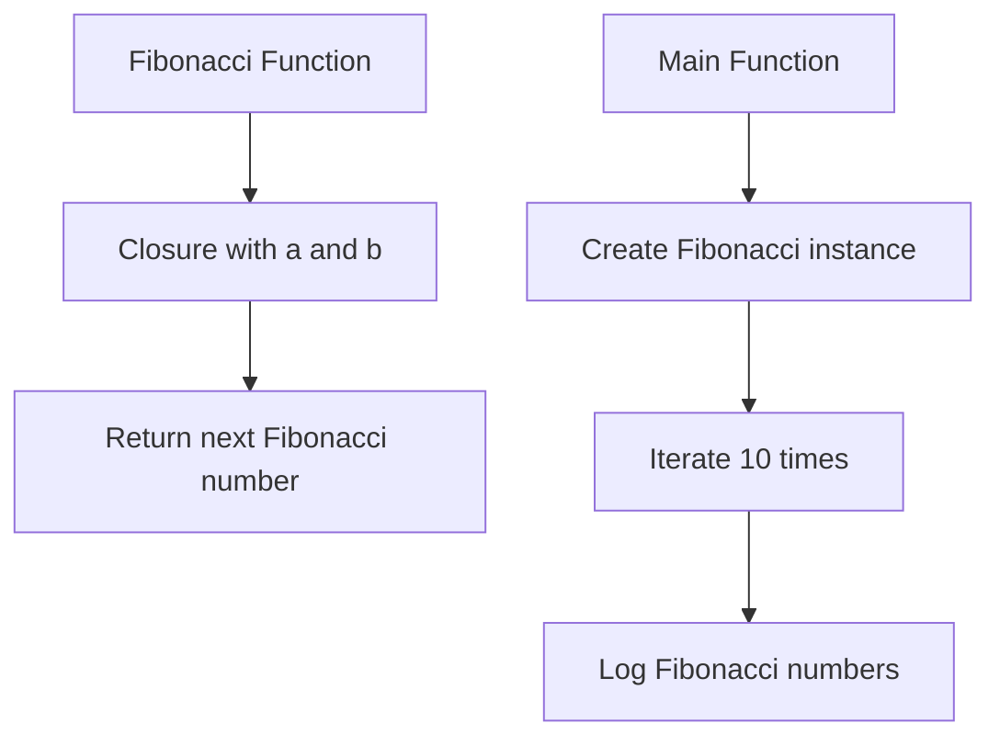

# Introduction

This document will walk you through the implementation of the "Release day folders test doc."

The purpose of this implementation is to generate a sequence of Fibonacci numbers and demonstrate its usage in a simple test scenario.

We will cover:

1. Why the Fibonacci function is implemented as a closure.
2. How the Fibonacci function is utilized in the main function.
3. The role of the main function in testing the Fibonacci sequence generation.

# Fibonacci function implementation

<SwmSnippet path="/src/utils/fibonacci.js" line="1">

---

The Fibonacci function is implemented as a closure to maintain state between function calls. This design allows the function to generate the Fibonacci sequence without external state management. The closure encapsulates the variables <SwmToken path="/src/utils/fibonacci.js" pos="1:6:6" line-data="// fibonacci is a function that returns">`a`</SwmToken> and <SwmToken path="/src/utils/fibonacci.js" pos="5:3:3" line-data="  let b = 1;">`b`</SwmToken>, which represent the current and next numbers in the sequence, respectively.

```
// fibonacci is a function that returns
// a function that returns an int.
function fibonacci() {
  let a = 0;
  let b = 1;
  return function() {
    let temp = a;
    a = b;
    b = temp + b;
    return a;
  };
}
```

---

</SwmSnippet>

# Utilizing the Fibonacci function

<SwmSnippet path="/src/utils/fibonacci.js" line="14">

---

The main function demonstrates the usage of the Fibonacci function by generating and logging the first ten numbers of the Fibonacci sequence. It creates an instance of the Fibonacci function and iterates over it, showcasing the sequence generation.

```
function main() {
    const fib = fibonacci();
    for (let i = 0; i < 10; i++) {
        console.log(fib());
    }
}
```

---

</SwmSnippet>

# Mermaid diagram

Below is a mermaid diagram illustrating the flow of the Fibonacci sequence generation and its usage in the main function:



This diagram visually represents the relationship between the Fibonacci function and its usage in the main function.

<SwmMeta version="3.0.0" repo-id="Z2l0aHViJTNBJTNBUmVsZWFzZURheVJlcG8lM0ElM0Fzd2ltbWlv" repo-name="ReleaseDayRepo"><sup>Powered by [Swimm](https://staging.swimm.cloud/)</sup></SwmMeta>
