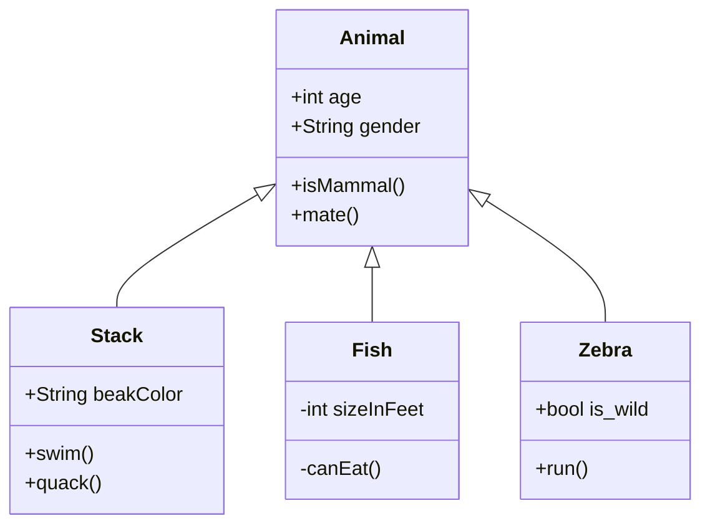

```mermaid
classDiagram
    Animal <|-- Stack
    Animal <|-- Fish
    Animal <|-- Zebra
    Animal : +int age
    Animal : +String gender
    Animal: +isMammal()
    Animal: +mate()
    class Stack {
      +String beakColor
      +swim()
      +quack()
    }
    class Fish{
      -int sizeInFeet
      -canEat()
    }
    class Zebra{
      +bool is_wild
      +run()
    }

%% Swimm:
%% classDiagram
%%     Animal <|-- <SwmToken path="/src/DocFlow/Stack.js" pos="2:2:2" line-data="class Stack {">`Stack`</SwmToken>
%%     Animal <|-- Fish
%%     Animal <|-- Zebra
%%     Animal : +int age
%%     Animal : +String gender
%%     Animal: +isMammal()
%%     Animal: +mate()
%%     class Stack {
%%       +String beakColor
%%       +swim()
%%       +quack()
%%     }
%%     class Fish{
%%       -int sizeInFeet
%%       -canEat()
%%     }
%%     class Zebra{
%%       +bool is_wild
%%       +run()
%%     }
```

<SwmMeta version="3.0.0" repo-id="Z2l0aHViJTNBJTNBcmVsZWFzZS1kYXklM0ElM0FtYWtzeW0tc3dpbW0=" repo-name="release-day">Powered by [Swimm](https://staging.swimm.cloud/)</SwmMeta>
