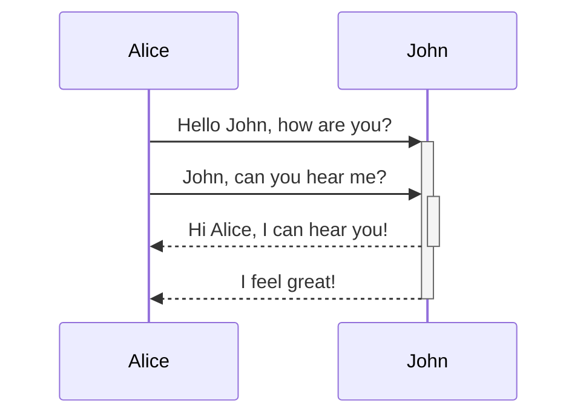

<SwmSnippet path="src/DocFlow/Stack.js" line="20">

---

Here we return the last element of the `items` array without removing it. <SwmToken path="/src/DocFlow/Stack.js" pos="2:2:2" line-data="class Stack {">`Stack`</SwmToken>

```
    peek() {
        asdddd
```

---

</SwmSnippet>

<SwmSnippet path="/src/DocFlow/Stack.js" line="22">

---

<SwmPath>[src/](/src/)</SwmPath>

```javascript
        return this.items[this.items.length - 1];
    }
```

---

</SwmSnippet>



<SwmLink doc-title="A new doc to test emails">[A new doc to test emails](/.swm/a-new-doc-to-test-emails.it2vaepg.sw.md)</SwmLink>

<SwmLink doc-title="Test playlist for doc flow">[Test playlist for doc flow](/.swm/test-playlist-for-doc-flow.wglvffmx.pl.sw.md)</SwmLink>asdasasdd

<SwmMeta version="3.0.0" repo-id="Z2l0aHViJTNBJTNBUmVsZWFzZURheVJlcG8lM0ElM0Fzd2ltbWlv" repo-name="ReleaseDayRepo"><sup>Powered by [Swimm](https://staging.swimm.cloud/)</sup></SwmMeta>
